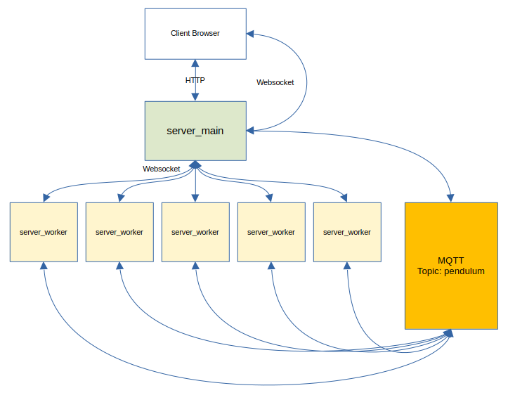

## About ##

Pendulum Simulation with UI interface and collision detection. All movements are calculated on the server side, and visualized in real-time on the client.


## Architecture ##


The project contains 3 parts:
1. main_server - HTTP / WebSocket server. It serves user interface HTML, REST, and WebSocket endpoints 
2. main_worker - WebSocket clients/servers to calculate physics, one Pendulum per instance.
3. mqtt4 folder with docker file and config to run mqtt server locally.

## Updates ##
- Added FPS for the Server and Client
- Added build.sh and run.sh scripts to simplify the running process.
- Added Pendulum numbers on the UI
- Added offset parameter for the collisions. server_main/.env COLLISION_OFFSET=5

## Info ##
- User interface uses P5JS to draw graphics
- Communication between the client browser and Main Server established through WebSocket protocol (socket.io)
- In addition, there is a REST HTTP communication, to get Initial Settings for all Pendulums and to Update settings.
- The Server Worker node is a WebSocket client for the Main Server, but it also uses MQTT Pub/Sub to send and receive messages, as mentioned in the requirements.
- For the speed optimization, all new settings (positions, etc...) for the graphics are coming through WebSockets.
- I'm using Matter-js Engine on the backend side for the physics calculation.
- Collision detection happening on the Main Server in real-time.

## Notes ##
- Almost no tests in the projects. Again because of the time limit. I added only 2 integration tests for REST endpoints. (do: cd main_server ,and npm test)
- No TypeScript for the client UI.
- The STOP button in the UI always resets settings to the default value.
- Then you click on the Ball in UI you can see additional settings. For now, it's just Ball Size and Friction Air, but basically, it's really easy to add others, like Mass, etc...

## HTTP Endpoint ##
```shell
$ curl -X GET http://localhost:8080/settings

> Response:
[
   {
      "angle" : -4,
      "angular_speed" : 60,
      "angular_velocity" : 100,
      "ball_mass" : 300,
      "ball_position" : {
         "x" : 82,
         "y" : 254
      },
      "ball_radius" : 20,
      "damping" : 4,
      "fill_color" : "orange",
      "friction_air" : 1,
      "gravity" : {
         "scale" : 0,
         "x" : 1,
         "y" : 0
      },
      "id" : "1",
      "name" : "P1",
      "rope_length" : 190,
      "rope_start_position" : {
         "x" : 200,
         "y" : 30
      },
      "server_port" : 8081,
      "type" : "pendulum"
   },
   ....
]
```

```shell
POST to http://localhost:8080/settings
with json: {"type":"pendulum","name":"P4","id":"4","fill_color":"green","ball_radius":50,"ball_position":{"x":562,"y":454},"rope_start_position":{"x":500,"y":30},"rope_length":250,"angle":9,"angular_velocity":0,"angular_speed":0,"damping":0.995,"gravity":{"x":1,"y":0,"scale":0},"ball_mass":3,"friction_air":0,"server_port":8084}

One pendulum settings at the time
```

## Websocket message ##

### Main Server ###

**1. init** (Main Server -> Clients)
> payload: [{pendulum obj 1},{pendulum obj 2}, ...]
___

**2. run** (Main Server -> Worker Clients)
___

**3. pause** (Main Server -> Worker Clients)
___

**4. stop** (Main Server -> Worker Clients)
> payload: [{pendulum obj 1},{pendulum obj 2}, ...] - new values for pendulums
___

**5. simulation_status** (Main Server -> UI)
> payload: {pendulum obj 1}
___

**6. restart_simulation** (Main Server -> UI) - restart simulation after collision

---

### Client UI ###

**1. run** (UI -> Main Server -> Worker Clients)
___

**2. pause** (UI -> Main Server -> Worker Clients)
___

**3. stop** (UI -> Main Server -> Worker Clients)

---

### Worker Server ###
**1. simulation_status** (Worker Server -> Main Server -> UI)
> payload: {pendulum obj 1}


## Technologies ##

The following tools were used in this project:

- [P5JS](https://p5js.org/)
- [Node.js](https://nodejs.org/en/)
- [MatterJS](https://brm.io/matter-js/docs/)
- [Socket.io](https://socket.io/)
- [MQTT mosquitto](https://mosquitto.org/)

## Requirements ##
```bash
$ cd mqtt5
$ sudo docker-compose -p mqtt5 up -d
```

```bash
$ cd server_main
$ npm -i 
```

```bash
$ cd server_worker
$ npm -i
```

## Starting ##
```bash
# Run main server (dev)
$ cd main_server
$ npm run dev

# Run build for prod
$ npm run build
# Run prod version
$ node out/index.js

# The server will initialize in the <http://localhost:3000>


# Run workers
$ cd main_worker

# Build for prod
$ npm run build

# Run worker 1 
$ HTTP_PORT=8081 MPID='1' npm run dev

# Run worker 2 
$ HTTP_PORT=8082 MPID='2' npm run dev

# Run worker 3 
$ HTTP_PORT=8083 MPID='3' npm run dev

# Run worker 4 
$ HTTP_PORT=8084 MPID='4' npm run dev

# Run worker 5 
$ HTTP_PORT=8085 MPID='5' npm run dev

# Run for prod
$ HTTP_PORT=XXX MPID='XXX' node out/index.js

# Using bash scripts
# run.sh script is going to run background processes, so to stop them, you should find them first.
$ cd pendulum
$ ./build.sh
$ ./run.sh


```

